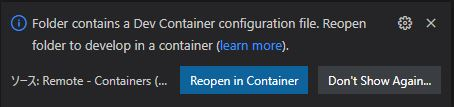

# spring-boot todo サンプル
## 概要
- spring-boot: 2.7.0
- java: 1.8
- gradle: 7.4.2
- db: h2database
- ui design: bootstrap 4.1.3
- docker環境
  - vscode remote-container
  - docker: mcr.microsoft.com/vscode/devcontainers/java:11-bullseye
- hostPC: windows10

## 実装内容
TODOを簡易的にController, Model, repositoryで作成  
ControllerはmockMVCとxpathを使ったテスト  
repositoryはUnitテスト

## 使用方法
VSCodeを開いた時に以下の画像が出た場合は「Reopen in Container」をクリック  
  
または  
Ctrl + Shit + P > >Remote-Containers: Reopen in Container  

### Ctrl + Shit + @ でターミナルを開いて以下を実行
### 初期化  
    gradle init
### ビルド  
    gradle build
### 起動
    gradle bootrun

起動を待って以下にアクセス  
http://localhost:8080/todo

## vscodeでlombo関連の警告やエラーが出る場合
拡張機能の Lombok Annotations Support for VS Code　を一度無効にしてからもう一度有効にすることで解消する場合がある 

